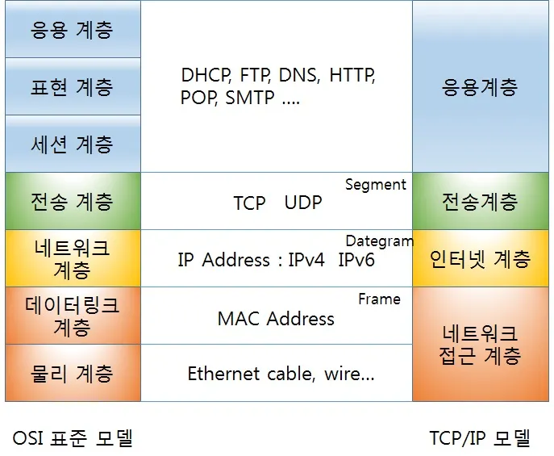
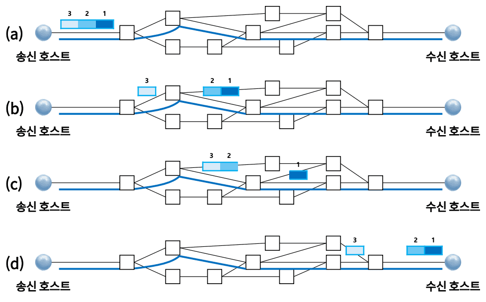
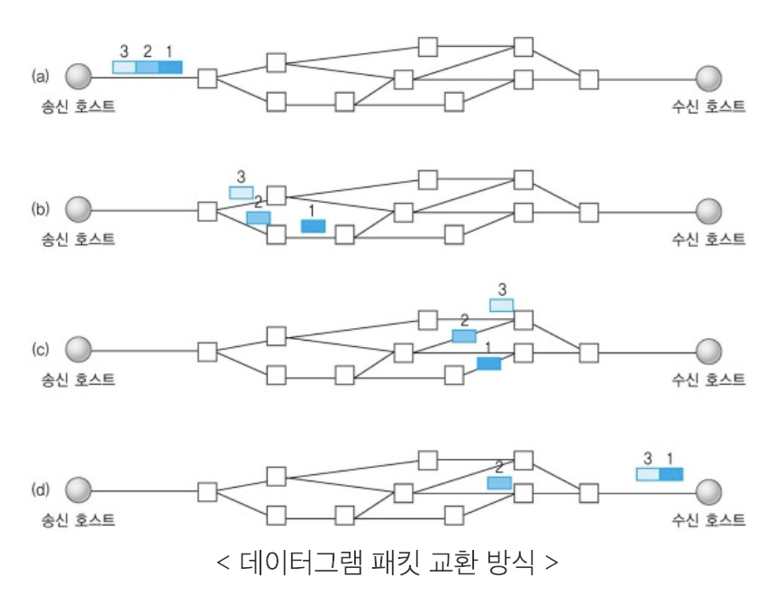
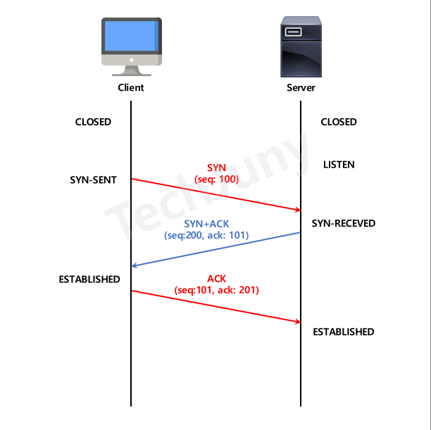
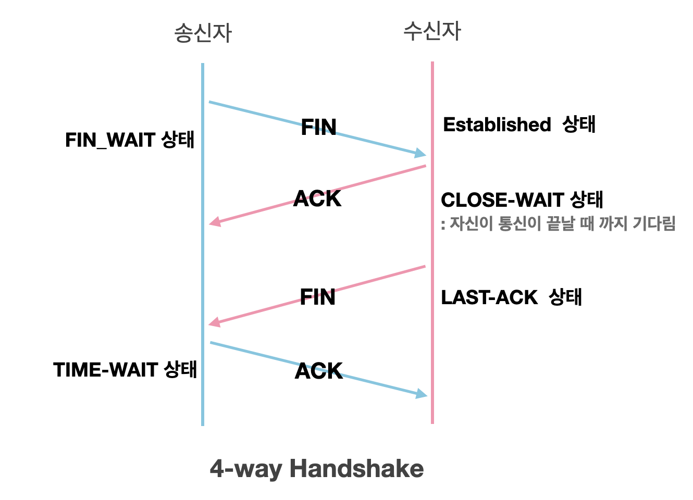

# Section 2 TCP/IP 4계층 모델

## 계층구조 - 애플리케이션 계층과 전송 계층

- TCP/IP 계층은 4계층, OSI 계층은 7계층
- 특정 계층이 변경되었을 때 다른 계층이 영향을 받지 않도록 설계됨

### 애플리케이션(응용) 계층
- 웹 서비스, 이메일 등 서비스를 실질적으로 사람들에게 제공하는 층
- FTP, HTTP, SSH, SMTP, DNS 등

#### FTP
- 장치와 장치간의 파일을 전송하는 데 사용하는 표준 통신 프로토콜
#### SSH
- 보안되지 않은 네트워크에서 네트워크 서비스를 안전하게 운영하기 위한 암호화 네트워크 프로토콜
#### HTTP
- WWW을 위한 데이터 통신의 기초이자 웹 사이트를 이용하는데 쓰는 프로토콜
#### SMTP
- 전자 메일 전송을 위한 인터넷 표준 통신 프로토콜
#### DNS
- 도메인 이름과 IP 주소를 매핑해주는 서버

### 전송 계층
- 송신자와 수신자를 연결하는 통신 서비스를 제공
- 연결 지향 데이터 스트림 지원, 신뢰성, 흐름 제어를 제공
- 애플리케이션과 인터넷 계층 사이의 데이터를 전달하는 중계 역할
- TCP, UDP

#### TCP
- 패킷 사이의 순서를 보장하고 연결지향 프로토콜 사용해서 연결을 하여 신뢰성을 구축
- **가상회선 패킷 교환 방식**을 사용
    - 각 패킷에 가상회선 식별자가 포함되어 있음
    - 패킷을 모두 전송하면 가상회선이 해체되고, 패킷들은 **전송된 순서대로** 도착

#### UDP
- 순서를 보장하지 않고 수신 여부를 확인하지 않음
- 단순히 데이터만 주는 **데이터 패킷 교환 방식** 사용
    - 패킷이 독립적으로 이동하며 최적의 경로를 선택
    - 하나의 메세지에서 분할된 여러 패킷은 서로 다른 경로로 전송될 수 있으며, 도착한 **순서가 다를 수 있음**

#### TCP 연결 성립 과정
- 신뢰성 확보를 위해 **3-way 핸드셰이크** 작업을 진행
- TCP는 3-way 핸드셰이크 과정이 있기에 신뢰성 있는 계층이라고 함

1. 클라이언트는 서버에 클라이언트의 ISN(seq)을 담은 SYN를 보냄
2. 서버는 서버의 ISN과 승인번호를 담은 SYN+ACK를 보냄
3. 클라이언트는 승인번호를 ACK에 담아 보냄

#### TCP 연결 해체 과정
- TCP가 연결을 해체할 때는 **4-way-핸드셰이크** 작업을 진행

1. 클라이언트가 서버에 FIN으로 설정된 세그멘트를 보내고, FIN_WAIT_1 상태로 들어감
2. 서버는 클라이언트에 ACK라는 승인 세그멘트를 보내고, CLOSE_WAIT_2 상태로 들어감, 클라이언트는 세그멘트를 받으면 FIN_WAIT_2 상태로 들어감
3. 서버는 일정 시간 후 클라이언트에 FIN 세그멘트를 보냄
4. 클라이언트는 TIME_WAIT 상태가 되고, 서버에 ACK를 보내 서버는 CLOSED 상태가 됨, 이후 클라이언트는 어느 정도 시간을 대기한 후 연결이 닫히면 클라이언트와 서버의 모든 자원 연결이 해체됨
- TIME_WAIT
    - 소켓이 바로 소멸되지 않고 일정 시간 유지되는 상태
    - 지연 패킷 발생을 대비하기 위힘