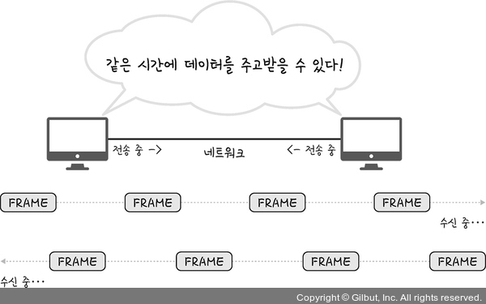
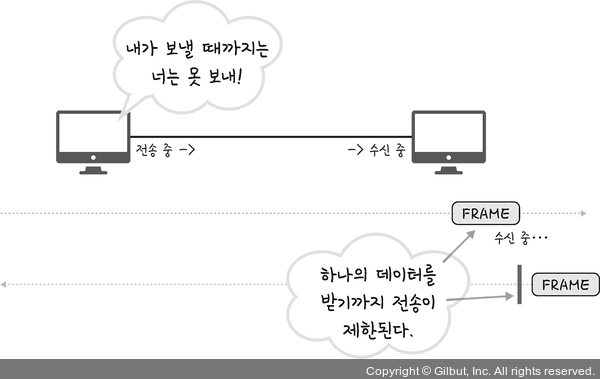
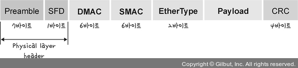
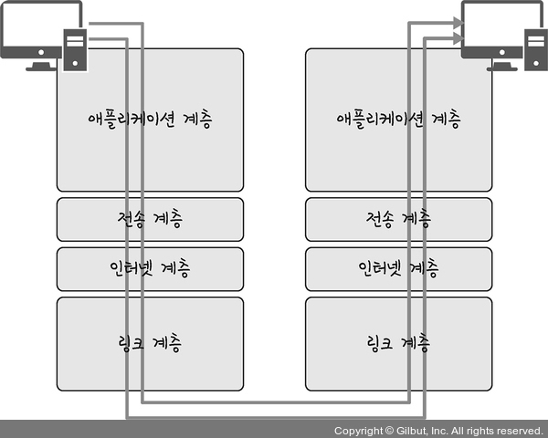
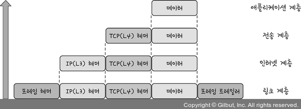

# Section 2 TCP/IP 4계층 모델

## 계층구조 - 인터넷 계층과 링크 계층

- TCP/IP 계층은 4계층, OSI 계층은 7계층
- 특정 계층이 변경되었을 때 다른 계층이 영향을 받지 않도록 설계됨

### 인터넷 계층
- 장치로부터 받은 네트워크 패킷을 IP 주소로 지정된 목적지로 전송하는 계층
- 상대방이 제대로 받았는지 보장하지 않는 **비연결형**적인 특징
- IP, ARP, ICMP 등

### 링크 계층
- 전선, 광섬유, 무선 등으로 실질적으로 데이터를 전당하며 장치 간에 신호를 주고받는 계층
- 물리 계층 - 무선 LAN, 유선 LAN을 통해 0과 1로 이루어진 데이터를 보내는 계층
- 데이터 링크 계층 - 이더넷 프레임을 통해 에러 확인, 흐름 제어, 접근 제어를 담당하는 계층

#### 유선 LAN (IEEE802.3)

- 전이중화 통신
    - 양쪽 장치가 **동시에 송수신**할 수 있는 방식
    - 송신로와 수신로로 나눠서 데이터를 주고 받음
    - 현대의 고속 이더넷 통신
- TP 케이블
    - 트위스트 페어 케이블
        - 하나의 케이블처럼 보이지만 실제로는 여덟 개의 구리선을 두 개씩 꼬아 묶은 케이블
        - UTP 케이블: 실드 처리를 하지 않고 덮은 케이블
        - STP 케이블: 실드 처리를 하고 덮은 케이블
    - 광섬유 케이블
        - 레이저를 이용하여 통신하기 때문에 구리선과 비교할 수 없을 만큼 빠름
        - 장거리 및 고속 통신이 가능

#### 무선 LAN (IEEE802.11)

- 반이중화 통신
    - 양쪽 장치는 서로 통신할 수 있지만, 동시에 통신할 수 없음
    - 한 번에 **한 방향만 통신** 가능
    - 장치가 신호를 수신하면 전송이 완료될 때 까지 기다려야 함
    - 둘 이상의 장치가 동시에 전송하면 충돌이 발생하여 메세지가 손실되거나 왜곡될 수 있음
    - 충돌 방지 시스템 필요
- CSMA/CA
    - 장치에서 데이터를 보내기 전 일련의 과정을 통해 사전에 가능한 한 충돌을 방지하는 방식
- 주파수
    - 무선 신호 전달 방식을 이용하여 2대 이상의 장치를 연결하는 기술
    - 2.4GHz 대역과 5GHz 대역
- 와이파이
    - 전자기기들이 무선 LAN 신호에 연결할 수 있게 하는 기술
    - 흔히 공유기라고 부르는 무선 접속 장치(AP)가 있어야 함
    - AP를 통해 유선 LAN에 흐르는 신호를 무선 LAN 신호로 바꿔주어 신호가 닿는 범위 내에서 무선 인터넷을 사용할 수 있음

#### 이더넷 프레임

- 데이터의 에러를 검출하고 캡슐화 함

### 걔층 간의 데이터 송수신 과정

- 캡슐화 과정: 애플리케이션 계층에서 링크 계층로부터 요청 값을 캡슐화 하는 과정
- 비캡슐화 과정: 링크 계층에서 애플리케이션 계층까지 데이터를 비캡슐화 하는 과정

#### 캡슐화 과정

1. 애플리케이션 게층: **데이터**
2. 전송 계층: TCP(L4) 헤더 + 데이터 = **세그먼트**
3. 인터넷 계층: IP(L3) 헤더 + 세그먼트 = **패킷**
4. 링크 계층: 프레임 헤더 + 패킷 + 프레임 트레일러 = **프레임**

#### 비캡슐화 과정

1. 링크 계층: **프레임**
2. 인터넷 계층: 프레임 - 프레임 헤더 - 프레임 트레일러 = **패킷**
3. 전송 계층: 패킷 - IP(L3) 헤더 = **세그먼트**
4. 애플리케이션 계층: 세그먼트 - TCP(L4) 헤더 = **데이터**