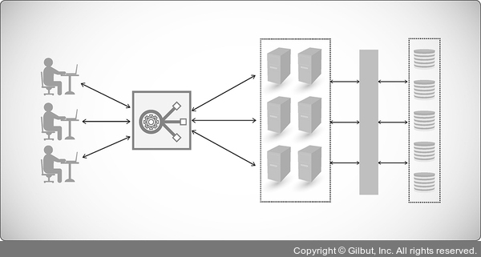

# Section 3 네트워크 기기

## 애플리케이션을 계층을 처리하는 기기 - L7 스위치

### L7 스위치

- **로드 밸런서** : 클라이언트로부터 오는 오청들을 뒤쪽의 여러 서버로 나누는 역할을 하며, 서버의 부하를 분산하며 시스템이 처리할 수 있는 트래픽 증가를 목표로 한다.
- **트래픽 모니터링** : URL, 서버, 캐시, 쿠키들을 기반으로 트래픽을 분산하며, 바이러스 등의 불필요한 외부 데이터를 걸러내는 필터링 기능을 수행한다.
- **헬스 체크** : 전송 주기와 재전송 횟수 등을 설정하여 반복적으로 서버에게 요청을 보내 정상, 비정상 여부 판별한다.
- **서버 이중화** : 2대 이상의 서버를 기반으로 가상 IP를 제공하여 안정적인 서비스를 제공한다.

#### L4 스위치와 L7 스위치 비교
| 구분 | L4 | L7 |
|---|---|---|
| 계층 | 전송 계층 | 응용 계층 |
| 트래픽 분산 | IP와 포트 기반 | URL, HTTP 헤더, 쿠키 기반 |
| AWS | NLB | ALB |