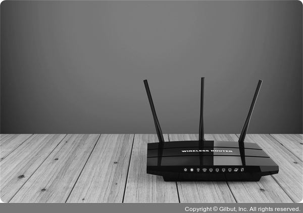

# Section 3 네트워크 기기

## 인터넷 계층을 처리하는 기기 - 라우터, L3 스위치

### 라우터

- 여러 개의 네트워크를 연결, 분할, 구분 시켜주는 역할을 한다.
- 다른 네트워크에 존재하는 장치끼리 서로 데이터를 주고 받을 때, 패킷 소모를 최소화하고 경로를 최적화하여 최소 경로로 패킷을 포워딩 한다.

### L3 스위치
- L2 스위치 기능 + 라우팅 기능
- 하드웨어 기반의 라우팅을 담당하는 장치

#### L3 스위치와 L2 스위치 차이
| 구분 | L2 | L3 |
|---|---|---|
| 참조 테이블 | MAC 주소 테이블 | 라우팅 테이블 |
| 참조 PDU | 이더넷 프레임 | IP 패킷 |
| 참조 주소 | MAC 주소 | IP 주소 |