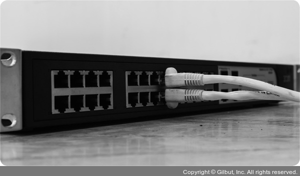
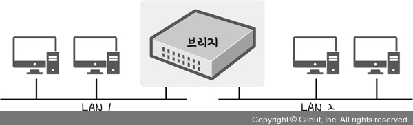

# Section 3 네트워크 기기

## 데이터 링크 계층을 처리하는 기기 - L2 스위치, 브리지

### L2 스위치

- MAC 주소를 MAC 주소 테이블을 통해 관리한다.
- 연결된 장치로부터 패킷이 왔을 때 패킷을 전송한다.
- 단순히 패킷의 MAC 주소를 읽어 스위칭하는 역할을 한다.
- 목적지에 MAC 주소 테이블이 없다면 전체 포트에 전달한다.
- MAC 주소 테이블의 주소는 일정 시간 이후 삭제할 수 있다.

### 브리지

- 두 개의 근거리 통신망(LAN)을 상호 접속할 수 있도록 하는 통신망 연결장치이다.
- 포트와 포트 사이의 다리 역할을 한다.
- MAC 주소를 MAC 주소 테이블을 통해 관리한다.
- 통신망 범위를 확장하고 하나의 통신망을 구축할 때 사용한다.
