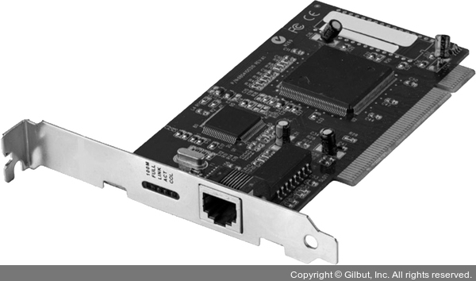
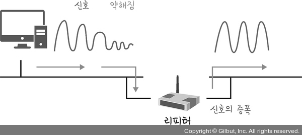
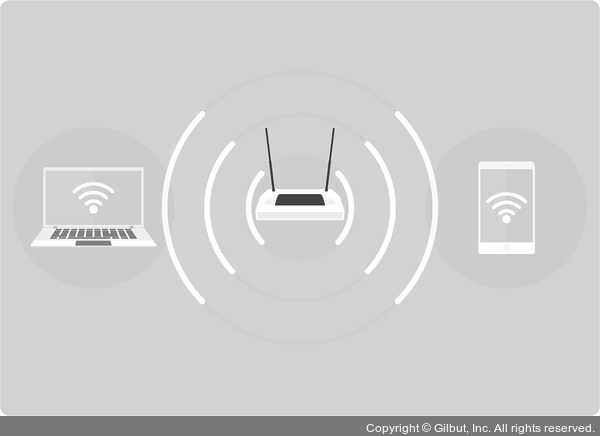

# Section 3 네트워크 기기

## 물리 계층을 처리하는 기기 - NIC, 리피터, AP

### NIC

- 네트워크 인터페이스 카드 (= LAN 카드)
- 2대 이상의 컴퓨터 네트워크를 구성하는데 사용한다.
- 네트워크와 빠른 속도로 데이터를 송수신할 수 있도록 컴퓨터 내에 설치하는 확장 카드이다.
- 각 LAN 카드에는 고유의 식별번호인 MAC 주소가 있다.

### 리피터

- 약해진 신호 정도를 증폭하여 다른 쪽으로 전달하는 장치이다.
- 현재는 광케이블이 보급됨에 따라 잘 쓰이지 않는 장치이다.

### AP(Access Point)

- 패킷을 복사하는 기기이다.
- AP에 유선 LAN을 연결한 후 다른 장치에서 무선 LAN을 사용하여 무선 네트워크를 연결할 수 있다.