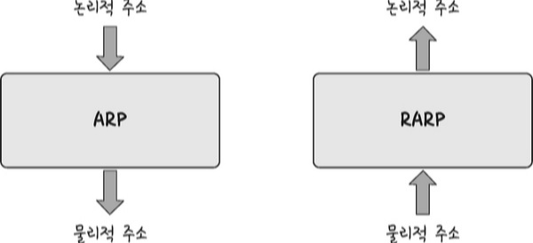
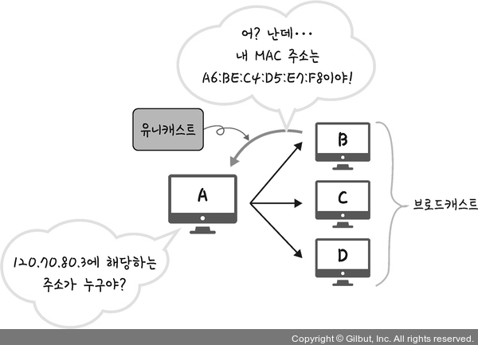

# Section 4 IP 주소

## ARP

### ARP란?

- IP 주소로부터 MAC 주소를 구하는 IP와 MAC 주소의 다리 역할을 하는 프로토콜
- ARP: 가상 주소 IP 주소 -> 실제 주소 MAC 주소로 변환
- RARP: 실제 주소 MAC 주소 -> 가상 주소 IP 주소로 변환

### ARP의 주소 찾는 과정

- 장치 A: ARP Request 브로드캐스트를 보내서 120.70.80.3에 해당하는 MAC 주소를 찾는다.
- 장치 B: ARP Reply 유니캐스트를 통해 MAC 주소로 반환하여 IP에 맞는 MAC 주소를 찾게된다.