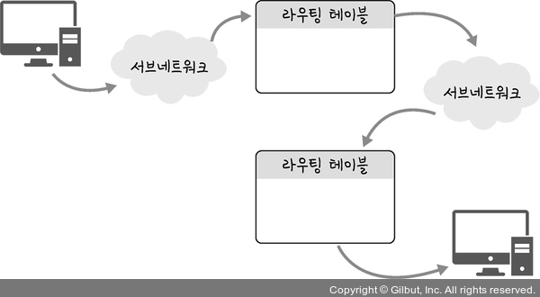

# Section 4 IP 주소

## 홉바이홉 통신

### 홉바이홉 통신이란?

- IP 주소를 통해 통신하는 과정
- 통신 장치에 있는 라우팅 테이블의 IP를 통해 시작 주소부터 시작하여 다음 IP로 계속해서 이동하는 라우팅 과정을 거쳐 패킷이 최종 목적지까지 도달하는 통신

### 라우팅 테이블
- 송신지에서 수신지까지 도달하기 위해 사용됨
- 라우터에 들어가 잇는 목적지 정보들과 그 목적지로 가기 위한 방법이 들어 있는 리스트

### 게이트웨이
- 서로 다른 통신망, 프로토콜을 사용하는 네트워크 간의 통신을 가능하게 하는 관문 역할 수행
- 서로 다른 네트워크상의 통신 프로토콜을 변환해주는 역할
- 확인 방법: `netstat -r`