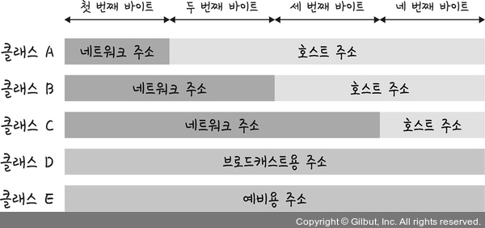

# Section 4 IP 주소

## IP 주소 체계

### IPv4와 IPv6 표기 방식
- IPv4: 32비트를 8비트 단위로
- Ipv6: 64비트를 16비트 단위로 

### 클래스 기반 할당 방식

- A, B, C, D, E 다섯 개의 클래스로 구분
- 클래스 A, B, C
  - 일대일 통신
  - 앞 부분을 네트워크 주소, 뒷 부분을 호스트 주소로 사용
- 클래스 D
  - 멀티캐스트 통신
- 클래스 E
  - 예비용 방식
- 예시
  - 클래스 A, 12.0.0.0 
    - 네트워크 주소: 12.0.0.0 
    - 호스트 주소: 12.0.0.1 ~ 12.255.255.254
    - 브로드캐스트용 주소: 12.255.255.255

### DHCP
- IP 주소 및 기타 통신 매개변수를 자동으로 할당하기 위한 네트워크 관리 프로토콜
- 네트워크 장치의 IP 주소를 수동으로 설정할 필요 없이 인터넷에 접속할 때마다 자동으로 IP 주소를 할당할 수 있다.
- 가정용 네트워크에서 IP 주소를 할당하는 데 대부분 사용

### NAT
- 패킷이 라우팅 장치를 통해 전송되는 동안 패킷의 IP 주소 정보를 수정하여 IP 주소를 다른 주소로 매핑하는 방법
- 공인 IP와 사설 IP를 나눠서 많은 주소를 처리
- 사설 IP를 공인 IP로 변환하거나 공인 IP를 사설 IP로 변환하는데 사용
- ICS, RRAS, Netfilter
- 내부에서 사용하는 IP 주소와 외부에 드러나는 IP 주소를 다르게 유지할 수 있기 때문에 네부 네트워크에 대해 보안 가능
- 여러 명이 동시에 인터넷을 접속하므로 접속 속도가 느려질 수 있음

### IP 주소를 이용한 위치 정보
- IP 주소는 인터넷에서 사용하는 네트워크 주소이기 때문에 동 또는 구까지 위치 추적이 가능